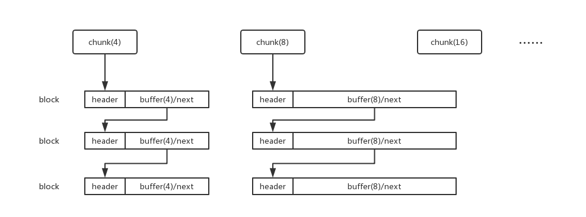

# 原理


内存池由若干chunk构成，不同档chunk下管理各自的block链表，4字节档chunk下的block空间为4字节，8字节档chunk下的block空间为8字节，以此类推，一直到1024字节档chunk。

当申请一个N字节的空间时，内存池找到正好>=N的chunk，然后搜索其下的block，返回一个空闲的block缓存地址。block分为头和实体，头指向所在的chunk，实体是一个union，未被分配时指向下一个block，若已分配则作为可使用缓存，此时block已脱离了整个空闲block链表，block被使用者释放后重新加入到空闲链表。

如果申请的空间比1024大，内存池会新创建一个新chunk，并在其下分配一个block。内存池被销毁后，所有分配内存都被回收。

# 使用
``` C++
MemoryPool* pool = new MemoryPool;
pool->report();
for (int i = 0; i < 1500; i++)
{
	char* str = (char*)pool->malloc(100);
	str[0] = 'm';
	pool->free(str);
}
pool->malloc(3000);
pool->report();
delete pool;
```
